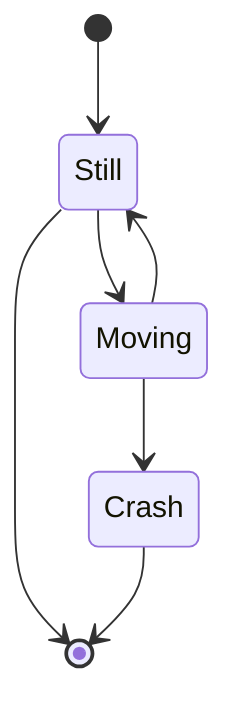

### n皇后问题

#### 问题描述

在$n \times n$的棋盘上放置n个皇后，使得每个皇后之间不相互攻击，求所有可能的放法。

#### 建模

* 解：向量$<x_1,x_2,\dots,x_n>$

#### 实例

以四皇后问题为例，求解过程如下：

```mermaid
stateDiagram
    [*] --> Still
    Still --> [*]

    Still --> Moving
    Moving --> Still
    Moving --> Crash
    Crash --> [*]
```