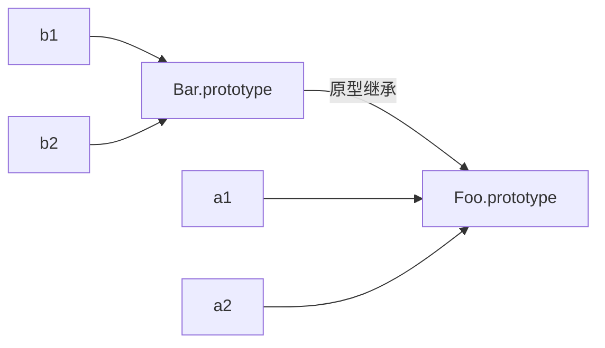

## 原型

*第 4 章中介绍的所有模拟类复制行为的方法，如各种混入，都没有使用 [[Prototype]] 链机制。*

### [[Prototype]]

[[Prototype]] 是JavaScript 对象的一个特殊**内置属性**。

```javascript
var myObject = {a: 2};
var anotherObject = Object.create(myObject);

anotherObject.a // 2
Object.getPrototypeOf(anotherObject) === myObject // true

let obj = Object.create(null);
Object.getPrototypeOf(obj); // null
```

#### 查找属性与原型链

引用对象的属性时会触发 [[Get]] 操作，比如```obj.a```。忽略```proxy```的情况下，[[Get]]操作的具体步骤为：

1. 检查对象本身收否有该属性
2. 如果本身没有，则沿原型链向上查找
3. 如果整条原型链上也没有，返回undefined

```for-in```循环和```in```操作也会查找原型链，它们的区别在于```for-in```访问的是可枚举的属性（enumerable: true），而```in```操作不需要。

```javascript
var proto = {};

Object.defineProperty(proto, 'a', {
  value: 2,
  enumerable: false
})

var obj = Object.create(proto);

for(var key in obj) {
  console.log(key); // 无法枚举到a
}

'a' in obj; // true
```

#### 属性设置和屏蔽

当属性不直接存在于对象，而是存在于原型链上时，情况有点复杂。

1. 如果在[[Prototype]]链上层存在名为foo的普通数据访问属性并且**没有被标记为只读(writable:false)**，那就会直接在 myObject 中添加一个名为 foo 的新属性，它是屏蔽属性。

2. 如果在[[Prototype]]链上层存在foo，但是它被标记为只读(writable:false)，那么无法修改已有属性或者在 obj 上创建屏蔽属性。

   如果运行在严格模式下，代码会抛出一个错误。

   否则，这条赋值语句会被忽略。总之，不会发生屏蔽。

3. 如果在[[Prototype]]链上层存在foo并且它是一个setter，那就**一定会调用这个 setter**。

   foo 不会被添加到obj，也不会重新定义 foo 这个 setter。

```javascript
var proto = { foo: 2 }
var obj = Object.create(proto);

obj.foo = 3; // 情况1 foo被添加

Object.defineProperty(proto, 'foo', {
  writable: false
})

obj.foo = 3; // 情况2 无法修改或报错

Object.defineProperty(proto, 'bar', {
  set: function(val) {
    this._bar = val;
  }
})

obj.bar = 3; // 情况3 无法修改
```

### “类”

请记住：***JavaScript中没有类，只有对象。***

实际上，JavaScript 才是真正应该被称为“面向对象”的语言，因为它是少有的可以不通过类，直接创建对象的语言。

在面向类的语言中，类可以被复制(或者说实例化)多次，就像用模具制作东西一样。

JavaScript 中，并没有类似类的复制机制。

你不能创建一个类的多个实例，只能创建多个对象，它们 [[Prototype]] 关联的是同一个对象。但是在默认情况下并不会进行复制。

#### 用原型模仿类

*JavaScript 中有一种奇怪的行为一直在被无耻地滥用，那就是模仿类。*

要模仿类，通常利用了函数的一种特殊特性:

**所有的函数默认都会拥有一个 名为 prototype 的公有并且不可枚举的属性，它会指向另一个对象。**

```javascript
function Foo() {}
Foo.prototype; // {}
```

这里要特别注意，**```一个对象的原型``` 和 ```一个对象的prototype属性``` 的区别。**

Foo函数的prototype属性不是Foo函数这个对象本身的原型，而是Foo函数构造产生的对象的原型。

```javascript
function Foo() {}
var obj = new Foo();

Object.getPrototypeOf(obj) === Foo.prototype // true
Object.getPrototypeOf(Foo) === Function.prototype // true
Object.getPrototypeOf(Function) === Function.prototype // true
```

第二章中提到过，用new操作符调用一个函数时的具体操作：

```javascript
function Foo(bar) {
  this.bar = bar;
}

var obj = new Foo('bar');
Object.getPrototypeOf(obj) === Foo.prototype // true
```

1. 创建一个全新的对象。
2. 这个新对象会被执行[[原型]]连接。
3. 这个新对象会绑定到函数调用的this。
4. 如果函数没有返回其他对象，则返回第一步中创建的对象。 

#### 那些为模仿类而生的名字

* 继承

  在 JavaScript 中，我们并不会将一个对象(“类”)复制到另一个对象(“实例”)，只是将它们关联起来。

  这个机制通常被称为*原型继承*。

  “继承”这两个字让人想起面向类编程，容易引起误解。

* 构造函数

  Foo.prototype 默认有一个公有并且**不可枚举**的属性 ```constructor```，这个属性引用的是对象关联的函数。

  ```javascript
  function Foo() {}
  Foo.prototype.constructor === Foo; // true
  
  var a = new Foo();
  a.hasOwnProperty('constructor'); // false
  a.constructor === Foo;
  ```

  Foo函数不会因为它是大写开头就变得特殊，它与其他函数没有任何区别。

  事实上，按模仿类的话来说，所有用new调用的函数都可以称之为“构造函数”。

  可以认为constructor属性是为了在模仿类的做法下，创建对象后方便找到它的构造函数而添加的一个引用，而这个constructor是**非常不可靠的**。

* 是否是实例 ( ```instanceof``` )

### 原型继承




```javascript
function Foo(name) {
  this.name = name;
}
Foo.prototype.myName = function() {
  return this.name;
};

function Bar(name,label) {
  Foo.call( this, name ); // 相当于super()
  this.label = label;
}
Bar.prototype.myLabel = function() {
  return this.label;
};

Bar.prototype // {}
'constructor' in Bar.prototype; // true

/* 我们创建了一个新的 Bar.prototype 对象并关联到Foo.prototype
	 注意!现在没有 Bar.prototype.constructor 了，
	 如果你需要这个属性的话可能需要手动修复一下它
	 比如 Bar.prototype.constructor = Bar */
Bar.prototype = Object.create( Foo.prototype ); // “继承”
// ES6可用setPrototypeOf
// Object.setPrototypeOf( Bar.prototype, Foo.prototype );

var a = new Bar( "a", "obj a" );
a.myName(); // "a"
a.myLabel(); // "obj a"
```

这段代码的核心部分就是语句 ```Bar.prototype = Object.create(Foo.prototype)```。

原型继承的错误做法：

* Bar.prototype = Foo.prototype; // 和你想要的机制不一样! 

  这样引用，对Bar.prototype的任何修改都会影响到Foo.prototype。

* Bar.prototype = new Foo(); // 基本上满足你的需求，但是可能会产生一些副作用

  如果函数 Foo 有一些副作用(比如写日志、修改状态、注册到其他对象、给 this 添加数据属性等等)的话，就会影响到 Bar() 的“后代”，后果不堪设想。

原型继承的正确做法：

* ```Bar.ptototype = Object.create( Foo.prototype );```  // ES6 之前需要抛弃默认的 Bar.prototype

* ```Object.setPrototypeOf( Bar.prototype, Foo.prototype );```// ES6 开始可以直接修改现有的 Bar.prototype

#### 检查“实例”所属的"类"

```javascript
function Foo() {}
var foo = new Foo();

foo instanceof Foo; // true
```

instanceof 操作符的左操作数是一个普通的对象，**右操作数是一个函数**。

instanceof 回答的问题是: **在 foo 的整条 [[Prototype]] 链中是否有指向 Foo.prototype 的对象?**

*同样地，可以认为 ```instanceof``` 是为了模仿类而加入的，目的类似 ```new``` 操作符*。

然而，```instanceof``` 只能判断对象与函数之间的关系，不能判断两个普通对象间的关系。

为了判断两个普通对象的关系：

* 荒谬的办法

  下面这段荒谬的代码试图站在“类”的角度使用 instanceof 来判断两个对象的关系

  ```javascript
  function isRelatedTo(o1, o2) {
    function F(){}
    F.prototype = o2;
    return o1 instanceof F;
  }
  var a = {};
  var b = Object.create( a );
  isRelatedTo( b, a ); // true
  ```

* 标准做法

  ```javascript
  Foo.prototype.isPrototypeOf( foo ); // true
  Object.getPrototypeOf( foo ) === Foo.prototype; // true
  ```

* 非标准做法

  大部分浏览器提供以下非标准的做法：

  ```javascript
  // __proto__ 可直接访问一个对象的原型
  foo.__proto__ === Foo.prototype; // true
  ```

  ```__proto__``` 看起来很像一个属性，但是实际上它更像一个 getter/setter。

  ```javascript
  Object.defineProperty( Object.prototype, "__proto__", {
    get: function() {
      return Object.getPrototypeOf( this );
    },
    set: function(o) {
      Object.setPrototypeOf( this, o );
      return o;
    }
  } );
  ```

###  Object.create

```Object.create(null) ``` 会创建一个拥有空[[Prototype]] 链接的对象，这个对象无法进行委托。
这些特殊的空 [[Prototype]] 对象通常被称作“字典”，它们完全不会受到原型链的干扰，因此非常适合用来存储数据。

```javascript
var foo = Object.create(null);
var plainObj = {}

plainObj.toString(); // [object Object]
foo.toString(); // TypeError: obj.toString is not a function
```

低版本下Object.create的polyfill：

```javascript
if (!Object.create) {
  Object.create = function(proto) {
    function F() {}
    F.prototype = proto;
    return new F();
  }
}
```

### 小结

* **[[Prototype]] 机制就是指对象中的一个内部链接引用另一个对象。**

* 查询对象属性时进行的[[Get]]操作，如果对象本身没有该属性，会沿原型链查找，直至找到或返回undefined。

* 对象原型链的顶端是```Object.prototype```，toString()、valueOf() 和其他一些通用的功能都存在于 Object.prototype 对象上，因此语言中所有的对象都可以使用它们。
* JavaScript中有很多模仿类的机制，但是不建议使用。

* 虽然这些 JavaScript 机制和传统面向类语言中的“类初始化”和“类继承”很相似，

  但是中有一个核心区别，那就是**JavaScript不会进行复制，对象之间是通过内部的 [[Prototype]] 链关联的**。

* 以“继承”结尾的术语(包括“原型继承”)和其他面向对象的术语都无法帮助你理解 JavaScript 的真实机制，

  相比之下，“委托”是一个更合适的术语，因为**对象之间的关系不是复制而是委托**。

