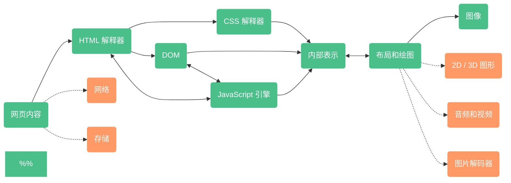

# 浏览器原理

## 浏览器与浏览器内核

### 浏览器

#### 浏览器发展史

*WroldWideWeb(nexus) -> netscape -> internet explorer -> mozila firefox -> safari -> chromium -> chrome*

#### 浏览器特性

浏览器功能：

*网络、资源管理、网页浏览、多页面管理、插件和拓展、书签管理、历史记录管理、设置管理、下载管理、账户、安全机制、隐私管理、外观主题、开发者工具等*

#### HTML5

html5包含了一系列标准，一共包含了10大的个类别。

*离线（offline）、存储（storage）、连接（connectivity）、文件访问（file access）、语义（semantics）、音频 / 视频（audio / video）、3D / 图形（3D / graphics）、展示（presentation）、性能（performance）、其他（nuts and bolts）*

|   类别   |                           具体规范                           |
| :------: | :----------------------------------------------------------: |
|   离线   | Application cache，Local storage，Indexed DB，在线 / 离线事件 |
|   存储   |        Application cache ，Local storage，Indexed DB         |
|   连接   |                 Web Sockets、Server-sent事件                 |
| 文件访问 |      File API，File system，FileWriter，ProgressEvents       |
|   语义   | 各种新元素，比如Media、structural，国际化，Link relation，属性，form类型，microdata等方面 |
| 音频视频 |         HTML5 video，WebAudio，WebRTC，Video track等         |
|  3D图形  |              Canvas2D，3D CSS变换，WebGL，SVG等              |
|   展示   |      CSS3 2D / 3D 变换，转换（transition），WebFonts等       |
|   性能   |                  Web Worker，HTTP caching等                  |
|   其他   |            触控和鼠标、Shadow DOM、CSS masking等             |

#### userAgent

*userAgent* 的作用在于让互联网的内容提供商了解发送请求的浏览器的身份，以便提供商根据不同浏览器提供不同的内容。

* *firefox* 包含 *Gecko*、*Firefox* 等关键词
* *IE* 包含 *Mozilla*、*MSIE*、*windows* 等关键词
* *safari* 包含 *AppleWebKit*、*safari* 等
* *chrome* 包含 *Mozilla*、*Android*、*AppleWebKit*、*Gecko*、*Chrome*、*safari* 等关键词

总的来说，因为某种浏览器的流行，很多内容提供商和网站需要根据流行的浏览器来定制内容，当后来者需要相同内容的时候，**就只能通过这些用户代理的信息来模仿获得**。

所以能看到，越往后出现的浏览器通常会包含老浏览器里的部分关键词。

### 浏览器内核

#### 什么是内核

浏览器的一个最重要的功能就是将页面转变成可视化的图像结果，这就是浏览器内核，通常也被称为**渲染引擎**。

所谓的渲染，就是根据描述或者定义构建数学模型，通过模型生成图像的过程。**浏览器的渲染引擎就是将 *html / css / javascript* 文本及其相应的资源文件转换成图像结果的模块。**

需要注意的是，渲染引擎和浏览器并非一一对应的，就像单个版本的Linux内核可以对应多个Linux操作系统的发行版。

以下是浏览器和渲染引擎的关系：

|                      | Trident |  Gecko  |                         Webkit                          |
| :------------------: | :-----: | :-----: | :-----------------------------------------------------: |
| 基于渲染引擎的浏览器 |   IE    | firefox | safari、chromium / chrome、Android 浏览器、chromeOS等等 |

事实上，根据Wikipedia上的数据，超过30种浏览器和Web平台是基于Webkit渲染引擎开发的。

#### 内核特征

从图中可以看出，一个渲染引擎主要包括 ***HTML解释器***、***CSS解释器***、***布局*** 和 ***JavaScript引擎*** 等，其他还有 ***绘图模块***、***网络*** 等并没有在图中直接表示出来，下面依次来描述他们。

* ***HTML解释器***：解释HTML文本的解释器，主要作用是将HTML文本解释成 ***DOM（文档对象模型）树***，*DOM* 是一种文档的表示方法。
* ***CSS解释器***：级联样式表的解释器，作用是为*DOM*中的各个元素对象计算出样式信息，从而为计算最后网页的布局提供基础设施。
* ***布局***：在*DOM*创建之后，*Webkit*需要将其中的元素对象和样式信息结合起来，计算它们的大小位置等布局信息，形成一个能够表示这所有信息的**内部表示模型**。

* ***JavaScript引擎***：使用JavaScript代码可以修改网页的内容，也能修改CSS的信息，JavaScript引擎能够解释JavaScript代码并通过 **DOM接口** 和 **CSSOM接口** 修来改网页内容和样式信息，从而改变渲染的结果。
* ***绘图***：使用图形库将布局计算后的各个网页的节点绘制成图像结果。

### webkit内核

#### webkit介绍

苹果公司参与网页渲染引擎 ***KHTML***

=> 苹果公司从 ***KHTML*** 中复制代码出来成立 ***webkit项目***

=> 苹果公司将 ***webkit项目*** 开源

=> google公司从 ***webkit项目*** 中复制代码成立 ***Blink项目***，并将其应用于 ***Chromium浏览器***

