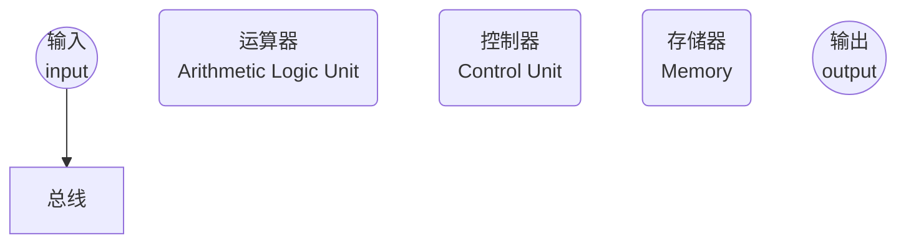

# 冯诺依曼结构

```mermaid
graph TB
		input((输入<br>input))
    ALU(运算器<br>Arithmetic Logic Unit)
    CU(控制器<br>Control Unit)
    memory(存储器<br>Memory)
    ouput((输出<br>output))
    BUS[总线]
    
    input --> BUS

     classDef green fill:#9f6,stroke:#333,stroke-width:2px;
     classDef orange fill:#f96,stroke:#333,stroke-width:4px;
     class sq,e green
     class di orange
```

### 运算器

### 控制器

### I / O

### 存储器

### 总线

## 指令系统

